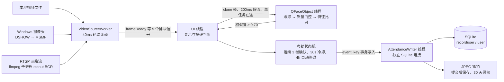

# Edge Video Face Attendance Console

基于 **Qt 5.12 + OpenCV 4.5.2 + SeetaFace2** 的 Windows 人脸考勤控制台：统一本地视频、本机摄像头与 RTSP 三类输入，在四线程流水线上跑完"解码 → 识别 → 考勤落库"闭环，断流自动重连。定位是 RK3568 边缘网关的**下游只读客户端**——上游板端 ZLMediaKit 出流，本机拉流做人脸比对与考勤记账，不碰网关任何设备与端口。

## 项目亮点

1. **三类视频源收敛成一套接口**：`IVideoSource` 抽象 + 8 状态统一状态机，文件 / 摄像头 / RTSP 运行时无重启切换，新增来源只需加一个实现类。
2. **四线程流水线，跨线程无锁**：UI、读帧、识别、存储各占一线程，全部经 Qt 排队信号串行交接；读帧不再阻塞界面，SQLite 写入靠独立连接躲开线程亲和性陷阱。
3. **RTSP 自愈链路**：独立 ffmpeg 子进程解码（本机 OpenCV 为 `FFMPEG: NO`，无网络后端），6 秒首帧超时 + 10 秒看门狗 + 3 秒重连调度，断流即暂停识别、作废在途请求，恢复后从零确认——不让断流前的旧结果写库。
4. **三层幂等防重复打卡**：连续 3 帧确认 → 按人 30 秒冷却 → 数据库 `event_key` 唯一索引，UI、业务、数据库各守一层。
5. **网络劣化全部量化过**：延时、抖动、周期断连、真实 5% IP 层丢包四轮注入实测，每轮都有帧数、FPS 与错误计数（见下表），不是"应该能扛"。

## 核心指标（实测，2026-09 完成）

| 指标 | 实测值 |
|---|---|
| 自动化测试 | **16/16** QtTest 全绿（`scripts/run-tests.ps1`） |
| 60 分钟板端长稳 | 75,747 帧 ≈ 21 FPS；第 442 秒真实断网 **19 秒自愈**，其后 52 分钟零错误，审计零重复 |
| 真实 IP 层 5% 丢包 | 5,714 帧 ≈ 19 FPS（较基线 -10%），**零断流**（TCP 重传扛住） |
| 板端 80ms 延时 + 40ms 抖动 | 6,361 帧 ≈ 21.2 FPS，零错误，与无劣化基线持平 |
| 板端 10 分钟识别考勤 | 12,208 帧；注册工号签到 0.8124、手动签退 0.8060，`source_type=rtsp` 记录审计零重复 |
| 三客户端并发 | 双 Qt 客户端 + ffprobe 同拉一路流，各 21–24.6 FPS 满速 |
| 特征比对单次 | ≈ 400 ms（402–418，CPU 推理固有开销；端到端均值取决于画面内容） |
| 帧率口径 | 本地预览 ≈ 25 FPS（40ms 定时驱动的显示上限）；板端 RTSP 实测 ≈ 21 FPS |

RTSP 链路（本机回环 / 跨机联调 / 延时抖动 / 周期断连 / 真实 5% IP 层丢包 / 小时级长稳 / 多客户端并发 / 识别考勤全链路）已于 2026-09-26 ~ 09-28 全部验证收口，证据见 [doc/01](doc/01-项目实施记录与下一步.md) 的 2.35、2.38、2.39、2.40 节。

## 系统架构



| 设计点 | 方案 |
|---|---|
| 并发模型 | 四线程（UI / 读帧 / 识别 / 存储），跨线程全走排队信号，退出用阻塞调用确保线程收尾 |
| RTSP 客户端 | `-rtsp_transport tcp` 拉流解码出 raw BGR；首帧 6s 超时、10s 无数据看门狗、重连默认 3s（500–60000ms 可配） |
| 质量门控 | 识别流程拦亮度 / 尺寸 / 清晰度（忽略姿态——SeetaFace 姿态判定极严，倾斜约 12° 即误杀）；注册流程四项全拦 |
| 数据一致性 | 参数化 SQL + 事务；抓拍在考勤事务**提交后**保存再回填路径；`schema_version` 迁移启动幂等执行 |
| 配置 | 20 项 `FACE_ATTENDANCE_*` 环境变量，全部带默认值与范围校验，配错回退不崩溃 |

## 快速开始

**前置**：Qt 5.12.0 MinGW 7.3（`D:\QT`）、OpenCV 4.5.2 与 SeetaFace2（`D:\qtdeps` junction）、Windows 10/11。路径不同就改 `scripts/build-qt5.ps1` 头部的三个变量。

```powershell
# 构建（输出 build-qt5-mingw-release\release\FaceAttendance.exe）
powershell -ExecutionPolicy Bypass -File .\scripts\build-qt5.ps1

# 16 项自动化测试（内存 SQLite + 测试替身，不依赖摄像头和网络）
powershell -ExecutionPolicy Bypass -File .\scripts\run-tests.ps1

# 开发启动（没有产物会先自动构建，注入模型与数据目录）
powershell -ExecutionPolicy Bypass -File .\scripts\run-dev.ps1

# 打包便携版（Qt 平台插件、SQLite 驱动、OpenCV/SeetaFace DLL、模型一并收进 dist\）
powershell -ExecutionPolicy Bypass -File .\scripts\package-windows.ps1
```

第三方 SDK、模型、运行数据库、人员照片、抓拍图、构建产物和发布 DLL 不进仓库。复制 `src/third_party.pri.example` 为 `src/third_party.pri`，按本机路径填 `THIRD_PARTY_ROOT` 即可。

## 项目结构

```text
src/
├── app/       main 入口；AppConfig——20 项 FACE_ATTENDANCE_* 环境变量的唯一出入口
├── media/     IVideoSource 抽象与三实现；RtspSource（ffmpeg 子进程）、重连调度器、
│              RTSP 配置对话框（仅存内存）、VideoSourceWorker 读帧线程
├── vision/    QFaceObject——检测/跟踪/特征比对封装；FaceQualityPolicy 质量门控策略
├── domain/    AttendanceStateMachine 签到签退状态机；CheckoutConfirmation 3 秒手动签退确认
├── storage/   AttendanceRepository 事务写入与幂等键；AttendanceWriter 存储线程；
│              DatabaseMigration 版本迁移；SnapshotStore 抓拍；报表与人员 CSV 导入导出
├── monitor/   VideoSourceRuntimeLog 运行事件（50 条环形 + runtime.log 持久化）；
│              PerformanceMetrics 性能 CSV
└── ui/        主窗口、注册页、查询页、Theme 主题

tests/         16 个 QtTest 工程（状态机/迁移/仓库/写入线程/RTSP 回环/读帧线程等）
scripts/       构建、测试、打包、长稳回归、网络劣化代理、便携包与 CSV 验收
doc/           实施记录、问题复盘、面试材料、RK3568 协作边界
```

## 文档导航

| 文档 | 内容 |
|---|---|
| [doc/00-文档目录.md](doc/00-文档目录.md) | 全部文档索引与状态标记说明 |
| [doc/01-项目实施记录与下一步.md](doc/01-项目实施记录与下一步.md) | 逐轮实施与验证记录（2.30–2.40），日常开发以此为准 |
| [doc/03-项目问题汇总-面试版.md](doc/03-项目问题汇总-面试版.md) | 面试口径与高频问题 |
| [doc/05-RK3568协作边界.md](doc/05-RK3568协作边界.md) | 与上游网关的强制协作边界 |

## 技术边界

- 人脸检测、特征匹配和考勤决策只在 Windows PC 端运行。
- RK3568 上的摄像头、麦克风、媒体编码和板端 RKNN 推理由网关独占；Windows 本机摄像头仅用于本项目独立开发，不参与网关联调。
- Qt 客户端只**主动拉取**可配置 RTSP 地址（预期格式 `rtsp://<rk3568-ip>:8554/live/camera`），不在 Windows 上启动 RTSP 服务端、不监听 8554 端口。
- SQLite、模型、抓拍、报表和日志保存在 Windows 本地应用数据目录，不与网关共享。抓拍默认保留 30 天，`FACE_ATTENDANCE_SNAPSHOT_RETENTION_DAYS` 可配 1–3650 天。
- 未做人脸活体检测；防重放目前靠连续帧确认、按人冷却与唯一索引三层兜底，活体是产品化第一升级位。
